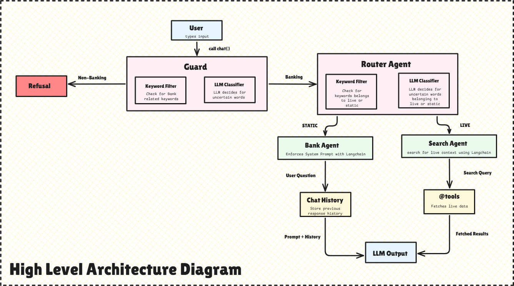

# BankAgent

BankAgent is a command-line banking assistant built using LangChain and Large Language Models (LLMs). It uses a two-agent architecture to answer banking-related questions while strictly refusing out-of-domain requests.

The system intelligently routes queries between a BankingAgent for general banking knowledge and a SearchAgent for real-time banking information.

---

# High Level Architecture



---


# Features

* Banking-only assistant
* Domain guard for query validation
* Static banking knowledge support
* Real-time banking information lookup
* Router-based multi-agent architecture
* Official bank website crawling
* Bank-specific link ranking
* Content extraction and parsing
* Gemini 2.5 Flash support
* Automatic Groq fallback
* Conversation history support
* Command-line interface

---

# Supported Queries

## BankingAgent (Static Knowledge)

Examples:

* What is KYC?
* What is EMI?
* Explain NEFT and RTGS.
* What is a savings account?
* How does loan eligibility work?
* What is a credit score?

These questions are answered directly from LLM knowledge.

---

## SearchAgent (Live Information)

Examples:

* Current SBI home loan interest rate
* Latest RBI repo rate
* Current HDFC FD rates
* Current ICICI savings account interest rate
* Recent RBI announcements
* Latest banking regulations

These questions use a custom search pipeline that discovers official bank websites, ranks relevant banking pages, crawls content, and generates responses using LLMs.

---

# Technology Stack

* Python
* LangChain
* Google Gemini 2.5 Flash
* Groq (Fallback LLM)
* Requests
* BeautifulSoup
* Playwright
* dotenv

---

# Requirements

* Python 3.10+
* One LLM API Key:

  * GOOGLE_API_KEY
  * OR GROQ_API_KEY

---

# Installation

## Create Virtual Environment

Windows:

```bash
python -m venv .venv
.venv\Scripts\activate
```

Linux / macOS:

```bash
python3 -m venv .venv
source .venv/bin/activate
```

---

## Install Dependencies

```bash
pip install -r requirements.txt
```

---

# Environment Variables

Create a `.env` file in the project root:

```ini
GOOGLE_API_KEY=your_google_api_key
GROQ_API_KEY=your_groq_api_key
```

Notes:

* At least one LLM key must be configured.
* Gemini is used as the primary LLM.
* Groq automatically acts as a fallback if Gemini fails.

---

# Run the Application

```bash
python main.py
```

---

# Available Commands

```text
help    → Show available commands
reset   → Clear conversation history
exit    → Exit the application
quit    → Exit the application
```

---

# Example Queries

### Static Query

```text
What is EMI?
```

Handled By:

```text
BankingAgent
```

---

### Live Query

```text
Current RBI repo rate
```

Handled By:

```text
SearchAgent
```

---

### Out-of-Domain Query

```text
What is the weather today?
```

Handled By:

```text
Refusal Response
```

---

# Running Tests

Run BankingAgent smoke test:

```bash
python -m tests.banking_agent_test
```

Run SearchAgent smoke test:

```bash
python -m tests.search_agent_test
```

---

# Known Limitations

* Some bank websites employ anti-bot or access-protection mechanisms that may prevent automated retrieval of publicly available information.
* Certain banks may require explicit website mappings if their official domains cannot be reliably discovered.
* Real-time information accuracy depends on accessibility of official bank websites at the time of the query.

---

# Future Enhancements

* RAG-based banking document retrieval
* Loan calculator tool integration
* Multi-bank comparison agent
* Banking FAQ knowledge base
* Web API and UI integration
* LangGraph orchestration for advanced workflows
* Expand supported bank registry
* Improved handling of anti-bot protected bank websites
* Credit card and offer extraction support
* Structured rate extraction from tables
